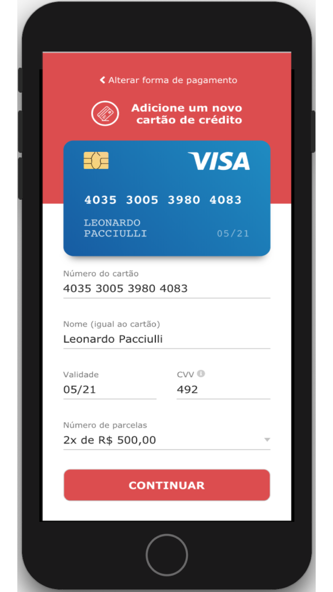

<h1 align="center">
👨🏻‍💻 Layout simulação de pagamento com cartão 👨🏻‍💻
</h1>

<br>

### 📝 Sobre o projeto
Desenvolvimento do layout simulando a forma de pagamento com um cartão de crédito inserindo os dados do cartão.

<br>

<div align="center">
  &nbsp;&nbsp;&nbsp;&nbsp;&nbsp;&nbsp;&nbsp;&nbsp;&nbsp;&nbsp;&nbsp;&nbsp;&nbsp;&nbsp;&nbsp;&nbsp;&nbsp;&nbsp;&nbsp;&nbsp;&nbsp;&nbsp;&nbsp;&nbsp;
  
</div>

<br>

## 🖥 Front-End
- Layout desenvolvido com ReactJS utilizando conceito de Hooks, e TypeScript;
- Layout totalmente responsivo para dispositivos mobile com tamanho até 360px;
- Utilizado Styled-components para estilização do layout;
- Utilizado a lib do react-credit-cards para simulação do cartão;
- Animação de Toast ao simular chamada a API feita com Context API;
- Simulação de uma chamada REST API para um endpoint fictício utilizando axios;

### 🛠 Tecnologias
- **[React.JS](https://reactjs.org/)**
- *[Lib-Credit-Cards](https://github.com/amarofashion/react-credit-cards)*
- *[TypeScript](https://www.typescriptlang.org/)*
- *[Styled-Components](https://styled-components.com/)*
- *[Axios](https://nodemon.io/)*

<br>

## 📱 Mobile
Responsivo com styled-components.

<br>

## 🏁 Baixar o projeto
Clonar: `git clone https://github.com/leopacciulli/CheckoutBexs.git`

<br>


🖥 Rodar o **Front-End**:

````zsh
# entrar na pasta do projeto
$ cd CheckoutBexs

# download das dependências
$ yarn

# start do projeto na porta 3000
$ yarn start
````
<br>

---


<h3 align="center">
  Made with love by 💙 Leonardo Pacciulli
</h3>

<p align="center">
  <a href="https://www.linkedin.com/in/leonardo-pacciulli">
    
  </a>
  <a href="https://www.facebook.com/paculli">
    
  </a>
  <a href="https://www.instagram.com/leopacciulli/">
    
  </a>
</p>
